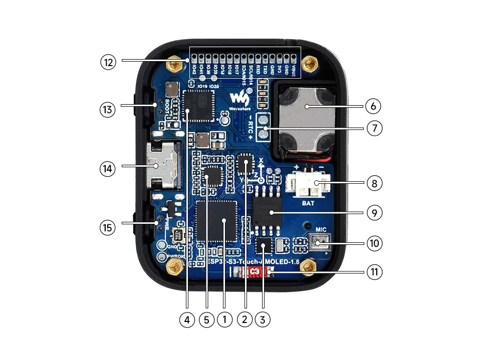
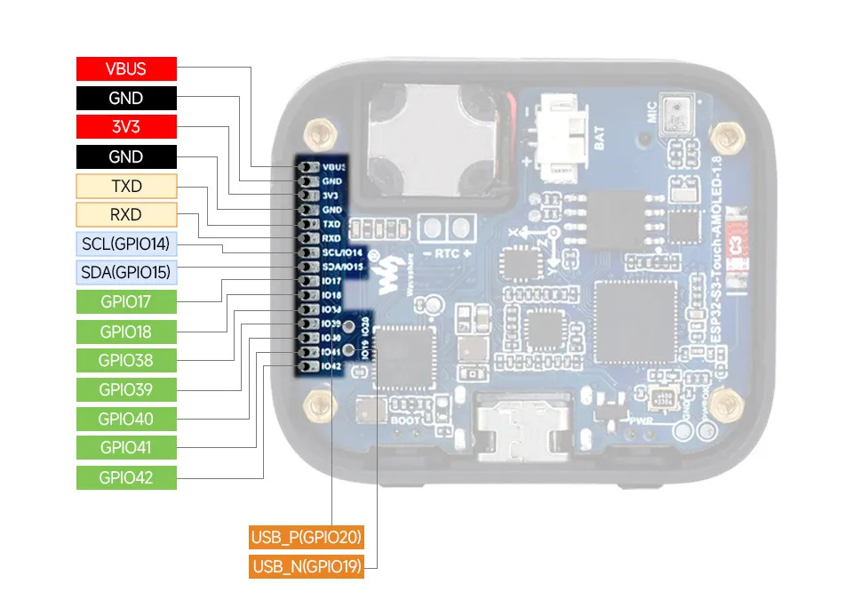
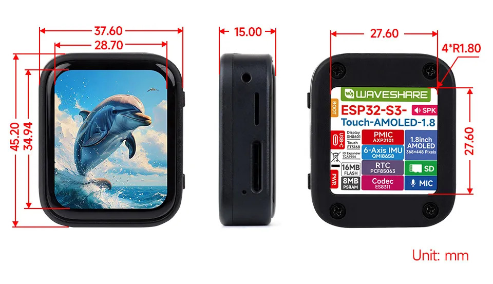

# Filename: README.org
# Description:
# Author: Damian Machtey
#
# Created: Wed May 20 06:50:51 2026 (-0300)
#
# Last-Updated: Thu May 21 04:15:22 2026 (-0300)
#+LATEX_CLASS: article
#+LATEX_CLASS_OPTIONS: [a4paper, 11pt, oneside]
#+TITLE: Detección de Intrusión mediante Análisis Vibracional en Estructuras Flotantes
#+AUTHOR: Damian Pablo Machtey
#+EMAIL: dmachtey@gmail.com
#+DATE: 2026-04-26
#+DESCRIPTION: Proyecto final para la asignatura Procesamiento Digital de Señales en Sistemas Embebidos (UNER)
#+OPTIONS: toc:2

* Introducción
** Contexto del Proyecto
El diseño de viviendas flotantes y estructuras modulares acuáticas
presenta desafíos únicos en seguridad. A diferencia de las estructuras
terrestres, las plataformas flotantes transmiten vibraciones mecánicas
de baja frecuencia de manera muy eficiente a través del chasis
(pontoons y marcos de soporte).

** Objetivo
Desarrollar un sistema embebido basado en **ESP32** y el sensor
**MPU-9150** (Acelerómetro/Giroscopio/Magnetómetro) capaz de detectar
la firma vibracional de pasos humanos sobre la plataforma y microfono,
diferenciándolos del movimiento/audio natural del agua (oleaje)
mediante técnicas de DSP y ML.

* Hardware seleccionado
https://docs.waveshare.com/ESP32-S3-Touch-AMOLED-1.8
- Waveshare ESP32-S3 1.8 Inch AMOLED Touch Display Development Board,
  32-Bit LX7 Dual-Core Processor, 368 x 448, Accelerometer & Gyroscope
  Sensor, ESP32 With Display, Support 3.7 V Li Battery(NOT Included)
**   About this item
 - Equipped with ESP32-S3R8 Xtensa 32-bit LX7 dual-core processor, up
   to 240MHz main frequency. Supports 2.4GHz Wi-Fi (802.11 b/g/n) and
   Bluetooth 5 (LE), with onboard antenna. Built in 512KB of SRAM and
   384KB ROM, with onboard 8MB PSRAM and an external 16MB Flash
   memory. Type-C connector, improving device compatibility, easier to
   use
 - Onboard 1.8 inch AMOLED display for clear color picture display,
   368 x 448 resolution, 16.7M color. Built-in SH8601 display driver
   and FT3168 capacitive touch chip, using QSPI and I2C communication
   respectively, effectively saving the IO resources. Onboard PWR and
   BOOT programmable buttons for easy custom function development
 - Onboard QMI8658 6-axis IMU (3-axis accelerometer and 3-axis
   gyroscope) for detecting motion gesture, counting steps,
   etc. Onboard PCF85063 RTC chip, powered by main Lithium battery
   through AXP2101 chip, with reserved RTC battery pads for connecting
   a backup battery, ensuring RTC function during the replacement of
   the main battery. Onboard 3.7 V MX1.25 lithium battery
   recharge/discharge header, support 3.7 V lithium battery (not
   included)
 - Reserved pads of 7 x GPIO, 1 x I2C, 1 x UART, and 1 x USB
   interface, for connecting peripherals and debugging. Onboard TF
   card slot for extended storage and fast data transfer, suitable for
   applications such as data recording and media playback, simplifying
   circuit design
 - Adopts AXP2101 IC for efficient power management, supports multiple
   voltage outputs, battery charging, battery management, and battery
   life optimization, etc. Adopts AMOLED screen, featuring advantages
   of high contrast, wide viewing angle, rich colors, fast response,
   thinner design, and low power consumption, etc
** Imagen
#+CAPTION: Placa
#+NAME: fig:placa
#+ATTR_LaTeX: :width 0.6\textwidth\textwidth :options angle=0 :placement [H]

1. ESP32-S3R8 WiFi and Bluetooth SoC, 240MHz operating frequency,
   stacked 8MB PSRAM
2. QMI8658 6-axis Inertial Measurement Unit (IMU), integrating a
   3-axis accelerometer and 3-axis gyroscope
3. PCF85063 RTC real-time clock chip
4. AXP2101 Highly integrated power management chip
5. ES8311 Audio codec, driving microphone input and speaker output via
   I²S interface
6. Speaker Onboard audio output, driven by ES8311
7. Backup Battery Pad Dedicated solder pad that keeps the RTC
   continuously powered when replacing the main battery, preventing
   time loss
8. MX1.25 Lithium Battery Connector MX1.25 2P connector for connecting
   a 3.7V lithium battery, supporting both charging and discharging
9. 16MB NOR Flash Mounted via SPI interface, available for storing
   firmware, UI assets, and user data
10. Microphone Onboard analog microphone that captures ambient audio,
    which is converted from analog to digital by the ES8311 and then
    processed by the ESP32-S3
11. Onboard Chip Antenna Supports 2.4 GHz Wi-Fi (802.11 b/g/n) and
    Bluetooth® 5 (LE)
12. Reserved 1mm Pitch GPIO Pads Exposes available IO pins for
    connecting external expansion modules
13. BOOT Button Hold during power-on to enter firmware download mode;
    can be assigned custom functions at runtime
14. Type-C Connector ESP32-S3 USB interface for flashing firmware and
    log output
15. PWR Power Button Controls power on/off, with support for
    customizable long-press/short-press behavior

#+CAPTION: PinOut
#+NAME: fig:pinout
#+ATTR_LaTeX: :width 0.6\textwidth\textwidth :options angle=0 :placement [H]

#+CAPTION: Dimensiones
#+NAME: fig:dim
#+ATTR_LaTeX: :width 0.6\textwidth\textwidth :options angle=0 :placement [H]

* data collector
 - Permite recolectar datos de campo, para el entrenamiento de modelo
   de ML, directamente con el teléfono.
 - logger:
   https://dmachtey.github.io/steps_detector/logger/phone-recorder.html

** raw data
- ./raw-data/

* Estructura del Clasificador y Clases de Detección

Para garantizar un funcionamiento robusto en el entorno real de la
estructura flotante, la definición de las clases a detectar es
fundamental.

** La Importancia de la Clase "Sin Caminar"
El estado "sin caminar" (reposo o ruido de fondo) debe ser una clase
obligatoria en el clasificador[cite: 406]. Si el modelo se entrena
únicamente con datos de "caminando", aprenderá a diferenciar sutilezas
entre pasos, pero predecirá falsamente "caminando" en todo momento
cuando no haya nadie en la plataforma[cite: 407]. El algoritmo
necesita conocer el movimiento natural de las olas y el silencio para
entender qué significa la ausencia de pasos[cite: 408]. Al incluir
esta clase, el modelo mapea las frecuencias caóticas del oleaje y las
ignora[cite: 418].

** Enfoques de Clasificación
Para estructurar el modelo se plantean dos alternativas[cite: 409]:
- Opción A (Clasificador Binario): Es la ruta más directa. Cuenta con
  una *Clase 1 (Caminando)*, que agrupa patrones repetitivos de
  impacto en el acelerómetro y audio [cite: 410]; y una *Clase 0 (Sin
  caminar)*, que engloba el ruido del viento, agua y perturbaciones
  ambientales[cite: 411].
- Opción B (Clasificador Multiclase): Agrega mayor robustez frente a
  perturbaciones del entorno[cite: 412]. Además de "Caminando" y
  "Estructura en Reposo" [cite: 413, 414], se incluye una clase de
  "Eventos Espurios" para falsos positivos como caídas de objetos,
  impactos bruscos del agua o ráfagas de viento fuertes[cite: 414].

** Balanceo de Datos
Para el entrenamiento es imperativo alimentar al modelo con una
cantidad equilibrada de muestras por clase. Si se extraen 150
segmentos de "caminando", se deben extraer cerca de 150 segmentos de
"sin caminar"[cite: 416]. Un desbalance (ej. 90% caminata y 10%
reposo) generaría un sesgo en el modelo, haciéndolo tender a
clasificar cualquier ruido como un paso[cite: 417].

* Preprocesamiento y Adaptación de Señales para Machine Learning

Para que las señales crudas recolectadas funcionen en el modelo final,
deben transformarse garantizando homogeneidad temporal y rangos
matemáticos controlados.

** 1. Alineación Temporal e Interpolación
Los datos crudos del acelerómetro móvil presentan desfases temporales
o /jitter/ entre muestras[cite: 354, 367]. Los modelos de Machine
Learning requieren que el intervalo entre datos sea estrictamente
constante[cite: 367].
- Se define el primer =timestamp_ms= del archivo CSV como el tiempo
  cero absoluto ($t_0$)[cite: 371]. El archivo de audio comparte
  exactamente este mismo instante de inicio[cite: 372].
- Se aplica una interpolación para forzar una frecuencia de muestreo
  fija de $50\text{ Hz}$ en el acelerómetro (una muestra exacta cada
  $20\text{ ms}$)[cite: 369, 373]. El audio mantiene su frecuencia
  fija de $8000\text{ Hz}$[cite: 376].

** 2. Segmentación por Ventanas (Windowing)
Los registros largos se cortarán en bloques o ventanas de $3\text{
segundos}$[cite: 384, 385]. Esto asegura que cada segmento contenga
entre 4 y 6 pasos continuos para capturar el ritmo[cite: 390].
- Por cada ventana, el acelerómetro ($50\text{ Hz}$) aportará 150
  puntos por eje ($X, Y, Z$)[cite: 387].
- Por cada ventana, el audio ($8000\text{ Hz}$) aportará 24,000
  puntos[cite: 388].
- Para multiplicar los datos de entrenamiento, se puede usar un
  solapamiento (/overlap/), avanzando el corte temporal cada $1\text{
  segundo}$[cite: 403, 404].

** 3. Normalización Global de Datos
La normalización no debe calcularse por ventana de 3 segundos de
manera independiente, ya que esto amplificaría el ruido del agua; los
parámetros deben calcularse de forma global usando todo el dataset de
entrenamiento[cite: 97, 99, 101, 102].
- Acelerómetro (Z-Score): Se utiliza la Estandarización centrado en
  cero, restando la media aritmética ($\mu$) y dividiendo por la
  desviación estándar ($\sigma$)[cite: 104, 105]. Esto permite
  eliminar la gravedad terrestre y la inclinación constante de la
  plataforma[cite: 108, 109].
- Audio (Min-Max Hardware): Se escalan los datos basándose en el
  límite físico del formato de 16 bits, dividiendo cada muestra cruda
  por 32768[cite: 112]. Esto garantiza valores entre -1 y 1
  conservando la proporción de la energía real[cite: 113].

** 4. Transformación de Características y Arquitectura Híbrida (Fusión de Sensores)
Al contar con el ESP32 conectado a la red eléctrica y sin problemas de
batería [cite: 155, 158], la limitación principal es la memoria RAM
(~520 KB), que colapsaría al inyectar 24,000 muestras de audio crudo
en una red profunda[cite: 159, 160]. La solución es una Arquitectura
Híbrida:
- Tratamiento de Audio: La ventana de 3 segundos no se pasa cruda,
  sino que se transforma en un Espectrograma Mel[cite: 162, 163]. Esta
  técnica convierte el sonido en una imagen 2D procesada por una Red
  Neuronal Convolucional (CNN)[cite: 164, 168].
- Tratamiento del Acelerómetro: Dada la baja cantidad de datos (150
  puntos por eje), las ondas de movimiento $X, Y, Z$ crudas y
  normalizadas se inyectan directamente al modelo a través de una red
  neuronal 1D[cite: 166, 167, 169].

** 5. Pipeline de Ejecución: Entrenamiento vs. Inferencia en Tiempo Real
- Fase de Entrenamiento (PC): El procesamiento se realiza localmente
  mediante scripts en Python. Se transforman los datos de las ventanas
  en conjuntos de características y espectrogramas para entrenar la
  red neuronal en la computadora de escritorio[cite: 145, 155].
- Fase de Inferencia (ESP32): Para el entorno de producción, las
  fórmulas de normalización, interpolación y transformación (como el
  cálculo del espectrograma) deben programarse explícitamente en el
  firmware en C++[cite: 150]. El microcontrolador capturará 3 segundos
  en vivo, procesará rápidamente el espectrograma y los 150 puntos de
  aceleración, e inmediatamente borrará la onda cruda de la memoria
  RAM[cite: 151, 152]. Los datos transformados se pasarán al modelo
  híbrido TensorFlow Lite para emitir la predicción[cite: 152, 176].
