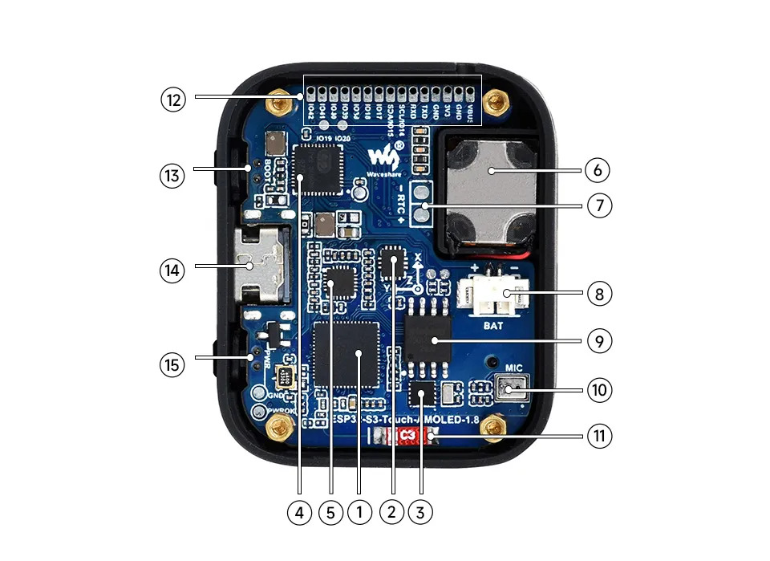
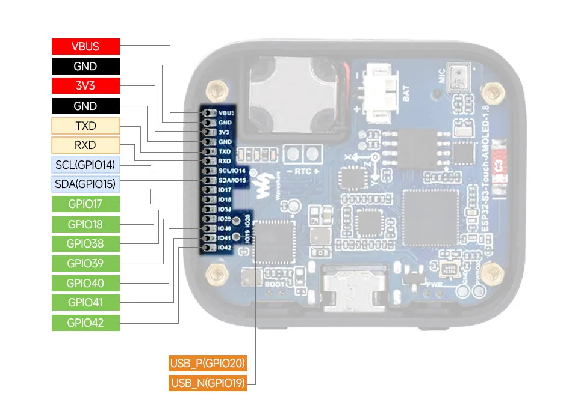
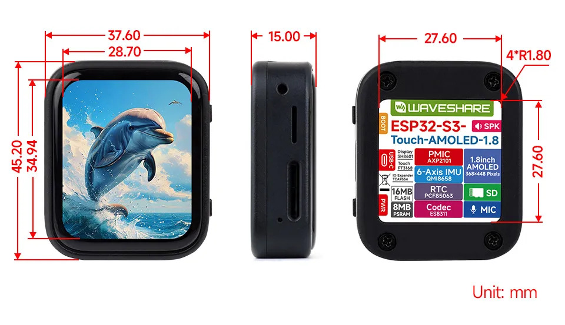

# Filename: README.org
# Description:
# Author: Damian Machtey
#
# Created: Wed May 20 06:50:51 2026 (-0300)
#
# Last-Updated: Sun May 31 07:14:50 2026 (-0300)
#+LATEX_CLASS: article
#+LATEX_CLASS_OPTIONS: [a4paper, 11pt, oneside]
#+TITLE: Detección de Intrusión mediante Análisis Vibracional en Estructuras Flotantes
#+AUTHOR: Damian Pablo Machtey
#+EMAIL: dmachtey@gmail.com
#+DATE: 2026-04-26
#+DESCRIPTION: Proyecto final para la asignatura Procesamiento Digital de Señales en Sistemas Embebidos (UNER)
#+OPTIONS: toc:2

* Introducción
** Contexto del Proyecto
El diseño de viviendas flotantes y estructuras modulares acuáticas
presenta desafíos únicos en seguridad. A diferencia de las estructuras
terrestres, las plataformas flotantes transmiten vibraciones mecánicas
de baja frecuencia de manera muy eficiente a través del chasis
(pontones y marcos de soporte).

** Objetivo
Desarrollar un sistema embebido basado en *ESP32-S3* capaz de detectar
la firma vibracional de pasos humanos sobre la plataforma y el
micrófono, diferenciándolos del movimiento/audio natural del agua
(oleaje) mediante técnicas de DSP (Procesamiento Digital de Señales) y ML (Machine Learning Clásico - Random Forest).

* Hardware seleccionado
https://docs.waveshare.com/ESP32-S3-Touch-AMOLED-1.8
- Waveshare ESP32-S3 1.8 Inch AMOLED Touch Display Development Board,
  32-Bit LX7 Dual-Core Processor, 368 x 448, Accelerometer & Gyroscope
  Sensor, ESP32 With Display, Support 3.7 V Li Battery(NOT Included)
- It was selected so I don't have to take care of device stability at
  least until I can manufacture it in a scale.

** About this device
 - Equipped with ESP32-S3R8 Xtensa 32-bit LX7 dual-core processor, up
   to 240MHz main frequency. Supports 2.4GHz Wi-Fi (802.11 b/g/n) and
   Bluetooth 5 (LE), with onboard antenna. Built in 512KB of SRAM and
   384KB ROM, with onboard 8MB PSRAM and an external 16MB Flash
   memory. Type-C connector, improving device compatibility, easier to
   use.
 - Onboard 1.8 inch AMOLED display for clear color picture display,
   368 x 448 resolution, 16.7M color. Built-in SH8601 display driver
   and FT3168 capacitive touch chip, using QSPI and I2C communication
   respectively, effectively saving the IO resources. Onboard PWR and
   BOOT programmable buttons for easy custom function development.
 - Onboard QMI8658 6-axis IMU (3-axis accelerometer and 3-axis
   gyroscope) for detecting motion gesture, counting steps,
   etc. Onboard PCF85063 RTC chip, powered by main Lithium battery
   through AXP2101 chip, with reserved RTC battery pads for connecting
   a backup battery, ensuring RTC function during the replacement of
   the main battery. Onboard 3.7 V MX1.25 lithium battery
   recharge/discharge header, support 3.7 V lithium battery (not
   included).
 - Reserved pads of 7 x GPIO, 1 x I2C, 1 x UART, and 1 x USB
   interface, for connecting peripherals and debugging. Onboard TF
   card slot for extended storage and fast data transfer, suitable for
   applications such as data recording and media playback, simplifying
   circuit design.
 - Adopts AXP2101 IC for efficient power management, supports multiple
   voltage outputs, battery charging, battery management, and battery
   life optimization, etc. Adopts AMOLED screen, featuring advantages
   of high contrast, wide viewing angle, rich colors, fast response,
   thinner design, and low power consumption, etc.

** Images
#+CAPTION: Placa
#+NAME: fig:placa
#+ATTR_LaTeX: :width 0.6\textwidth\textwidth :options angle=0 :placement [H]

1. ESP32-S3R8 WiFi and Bluetooth SoC, 240MHz operating frequency,
   stacked 8MB PSRAM.
2. QMI8658 6-axis Inertial Measurement Unit (IMU), integrating a
   3-axis accelerometer and 3-axis gyroscope.
3. PCF85063 RTC real-time clock chip.
4. AXP2101 Highly integrated power management chip.
5. ES8311 Audio codec, driving microphone input and speaker output via
   I²S interface.
6. Speaker Onboard audio output, driven by ES8311.
7. Backup Battery Pad Dedicated solder pad that keeps the RTC
   continuously powered when replacing the main battery, preventing
   time loss.
8. MX1.25 Lithium Battery Connector MX1.25 2P connector for connecting
   a 3.7V lithium battery, supporting both charging and discharging.
9. 16MB NOR Flash Mounted via SPI interface, available for storing
   firmware, UI assets, and user data.
10. Microphone Onboard analog microphone that captures ambient audio,
    which is converted from analog to digital by the ES8311 and then
    processed by the ESP32-S3.
11. Onboard Chip Antenna Supports 2.4 GHz Wi-Fi (802.11 b/g/n) and
    Bluetooth® 5 (LE).
12. Reserved 1mm Pitch GPIO Pads Exposes available IO pins for
    connecting external expansion modules.
13. BOOT Button Hold during power-on to enter firmware download mode;
    can be assigned custom functions at runtime.
14. Type-C Connector ESP32-S3 USB interface for flashing firmware and
    log output.
15. PWR Power Button Controls power on/off, with support for
    customizable long-press/short-press behavior.

#+CAPTION: PinOut
#+NAME: fig:pinout
#+ATTR_LaTeX: :width 0.6\textwidth\textwidth :options angle=0 :placement [H]

#+CAPTION: Dimensiones
#+NAME: fig:dim
#+ATTR_LaTeX: :width 0.6\textwidth\textwidth :options angle=0 :placement [H]

** Programming examples:
https://github.com/waveshareteam/ESP32-S3-Touch-AMOLED-1.8/tree/main

* Manual de Uso y Configuración

El sistema opera bajo FreeRTOS y se controla a través de la pantalla táctil mediante la librería gráfica LVGL.

** 1. Arranque y Pantalla Principal
Al energizar el equipo, el sistema operativo inicializa la memoria NVS, el hardware (pantalla, I2C, I2S, SDMMC) y la interfaz gráfica.
Desde la pantalla principal (fondo negro), el usuario tiene dos opciones:
- *Activar Alarma:* Inicia el modo de vigilancia.
- *Configuración:* Accede a los parámetros del sistema y herramientas de telemetría.

** 2. Configuración del Dispositivo
En el menú de "Ajustes del Sistema" se pueden gestionar los siguientes parámetros:
- *Conectividad (WiFi):* Permite ingresar el SSID y Contraseña de la
  red local mediante un teclado táctil en pantalla. Las credenciales
  se almacenan de forma persistente en la memoria NVS.
- *Dispositivo (Hostname):* Permite definir un nombre personalizado para identificar al equipo en la red (ej. =PONTON-01=).
- *Reloj (RTC):* El sistema sincroniza automáticamente su hora usando
  servidores SNTP (=pool.ntp.org= y =time.google.com=) cuando hay
  conexión a internet. La zona horaria está configurada internamente.
- *Registro de Sensores:* Herramienta fundamental para graficar en
  tiempo real el comportamiento del acelerómetro y el micrófono. Y que
  permite la captura de datos para entrenamiento del modelo
  grabandolos en la sd.

** 3. Modo Alarma (Vigilancia)
Al presionar "Activar Alarma", la interfaz cambia a un estado de bajo perfil visual (color gris oscuro neutro).
- *Análisis en vivo:* En segundo plano, la tarea principal procesa los sensores en fragmentos de 20ms, sincronizando vibración (IMU) y sonido (Micrófono I2S vía DMA).
- *Estado Normal:* Mientras la Inteligencia Artificial dictamine que el movimiento corresponde al agua o viento, la pantalla se mantiene neutral.
- *Detección (Alerta):* Si el modelo Random Forest detecta patrones de pasos humanos, la pantalla emite un pantallazo visual en color *ROJO* durante 30 segundos exactos, tras lo cual se restablece de forma automática sin bloquear el análisis.

* Estructura de Software

El código fuente está modularizado aplicando el principio de Separación de Intereses (Separation of Concerns).

| Directorio / Módulo | Descripción / Responsabilidad |
|---------------------+-------------------------------|
| =main/main.c=       | Punto de entrada (=app_main=). Levanta la NVS, el BSP, inicializa LVGL y orquesta las tareas. |
| =main/hardware/=    | *BSP (Board Support Package).* Abstracción de hardware. Maneja el I2C (=hw_imu=), el I2S DMA (=hw_mic=), el QSPI (=hw_display=), la SD (=hw_sd=) y el reloj (=hw_rtc=). |
| =main/gui/=         | *Interfaz Gráfica.* Vistas y controladores de pantalla desarrollados sobre LVGL. =gui_hw.c= gestiona los buffers DMA y el Mutex para asegurar concurrencia. |
| =main/alarm_logic/= | *Procesamiento e IA.* =dsp_audio.c= utiliza =esp-dsp= para cálculo de Energía y FFT. =alarm_core.c= sincroniza lecturas y llama a =Classifier.c= (el modelo). |

* Entrenamiento y Machine Learning: Reentrenar el Modelo

El sistema utiliza Machine Learning Clásico (Random Forest) optimizado para microcontroladores. Dado que la plataforma flotante posee un entorno acústico y mecánico muy dinámico (impacto de lanchas, tormentas), es necesario capturar datos locales (/edge cases/) para evitar falsos positivos y robustecer la IA.

** Paso 1: Recolección de Datos (Datalogger)
1. Navegar al menú de =Configuración= -> =Aplicaciones: Registro de Sensores=.
2. Visualizar la telemetría en tiempo real.
3. Usar el menú desplegable para seleccionar la etiqueta:
   - =caminando=: Caminar sobre la estructura con distintos tipos de calzado.
   - =sin_caminando=: Grabar ruido ambiental, impacto de olas, viento fuerte.
4. Presionar "Iniciar". Los datos se guardarán en archivos
   estructurados directamente en la tarjeta SD (montada en =/sdcard=).

** Paso 2: Procesamiento en Python y Reentrenamiento
1. Retirar la tarjeta SD e insertar en la PC. Copiar los archivos a la carpeta del proyecto en Python.
2. Ejecutar el script =entrenar_clasico.py=. Este script realiza lo siguiente:
   - Extrae 3 características del audio usando el módulo simulado de DSP (RMS, Cruces por Cero y Frecuencia Dominante).
   - Acopla las firmas de vibración del acelerómetro interpoladas a 50Hz.
   - Entrena el ensamble de árboles de decisión (Random Forest).
   - Traduce automáticamente el modelo matemático resultante a lenguaje C nativo.

** Paso 3: Actualización del Firmware
1. El script de Python generará dos archivos: =Classifier.c= y =Classifier.h=.
2. Copia y reemplaza estos archivos dentro del directorio =step_alarm/main/alarm_logic/= del proyecto ESP-IDF.
3. Compilar y flashear el equipo. El dispositivo iniciará con el nuevo "cerebro" actualizado.

* Compilación y Flasheo

** Dependencias y Requisitos del Sistema
- *Framework:* ESP-IDF v5.3 o superior.
- *Componentes Extra:* =espressif/esp-dsp= (procesamiento SIMD), =espressif/esp_lcd_touch_ft5x06=, =espressif/es8311=, =lvgl/lvgl= (v8.4.*).
- *Memoria:* Requiere habilitar la PSRAM octal en =menuconfig= debido a los buffers de audio y gráficos.

** Instrucciones de Compilación
#+BEGIN_SRC bash
# Cargar el entorno de ESP-IDF
. $HOME/esp/v5.3/esp-idf/export.sh

# Compilar, flashear y monitorear el puerto serie
idf.py build flash monitor
#+END_SRC

* Estructura Teórica del Clasificador y Clases de Detección

Para garantizar un funcionamiento robusto en el entorno real de la
estructura flotante, la definición de las clases a detectar es
fundamental.

** La Importancia de la Clase "Sin Caminar"
El estado "sin caminar" (reposo o ruido de fondo) debe ser una clase
obligatoria en el clasificador. Si el modelo se entrena únicamente con
datos de "caminando", aprenderá a diferenciar sutilezas entre pasos,
pero predecirá falsamente "caminando" en todo momento cuando no haya
nadie en la plataforma. El algoritmo necesita conocer el movimiento
natural de las olas y el silencio para entender qué significa la
ausencia de pasos. Al incluir esta clase, el modelo mapea las
frecuencias caóticas del oleaje y las ignora.

** Balanceo de Datos
Para el entrenamiento es imperativo alimentar al modelo con una
cantidad equilibrada de muestras por clase. Si se extraen 150
segmentos de "caminando", se deben extraer cerca de 150 segmentos de
"sin caminar". Un desbalance generaría un sesgo en el modelo,
haciéndolo tender a clasificar cualquier ruido como un paso.

* Preprocesamiento y Adaptación de Señales para Machine Learning

Para que las señales crudas recolectadas funcionen en el modelo final,
deben transformarse garantizando homogeneidad temporal y rangos
matemáticos controlados.

** 1. Alineación Temporal e Interpolación
Los modelos de Machine Learning requieren que el intervalo entre datos
sea estrictamente constante.
- Se aplica una interpolación para forzar una frecuencia de muestreo
  fija de $50\text{ Hz}$ en el acelerómetro (una muestra exacta cada
  $20\text{ ms}$). El audio mantiene su frecuencia fija de $8000\text{ Hz}$.

** 2. Segmentación por Ventanas (Windowing)
Los registros largos se cortan en bloques o ventanas de $3\text{
segundos}$. Esto asegura que cada segmento contenga múltiples pasos
continuos para capturar el ritmo.

** 3. Transformación de Características (Fusión de Sensores)
Al contar con limitaciones de RAM en el microcontrolador (a pesar de
la PSRAM), no es viable inyectar 24.000 muestras de audio crudo por
ventana en el modelo de Machine Learning local:
- *Tratamiento de Audio:* La ventana de 3 segundos no se evalúa
  cruda. Se utilizan funciones matemáticas sobre =esp-dsp= para
  calcular su Energía global (RMS), la tasa de cambio de signo
  (Zero-Crossing Rate) y su componente frecuencial dominante a través
  de la Transformada Rápida de Fourier (FFT).
- *Tratamiento del Acelerómetro:* Dada la baja densidad de datos (150
  puntos por eje en la ventana de 3 segundos), las ondas de movimiento
  $X, Y, Z$ crudas se acoplan directamente a las características
  extraídas del audio para conformar un único vector de entrada que
  alimenta al modelo Random Forest.
